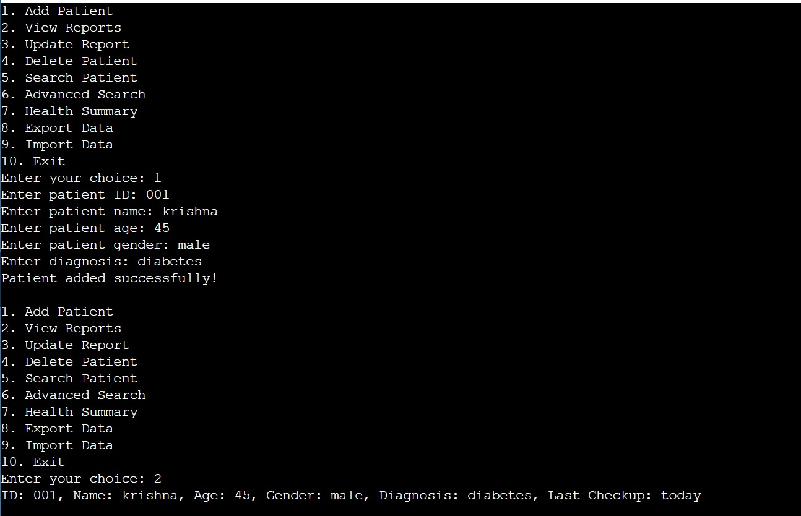
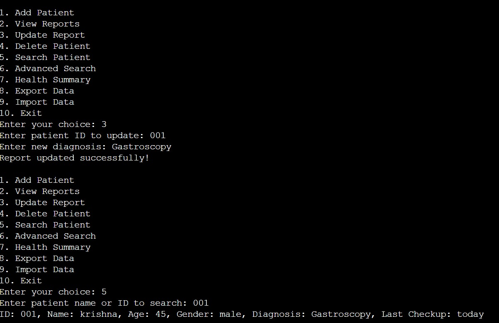
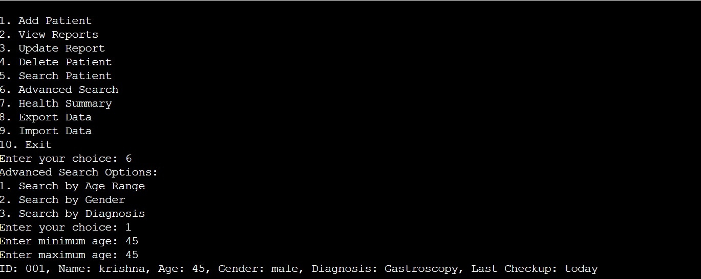
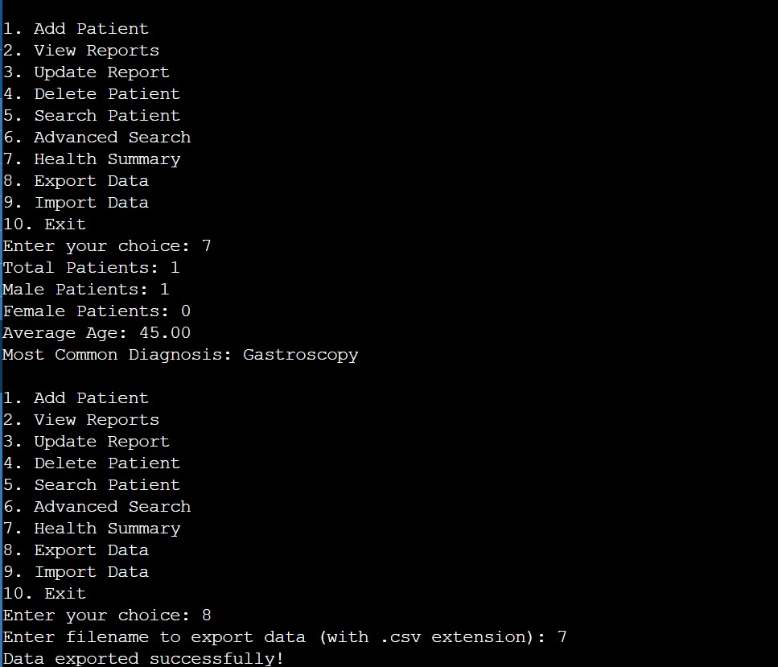
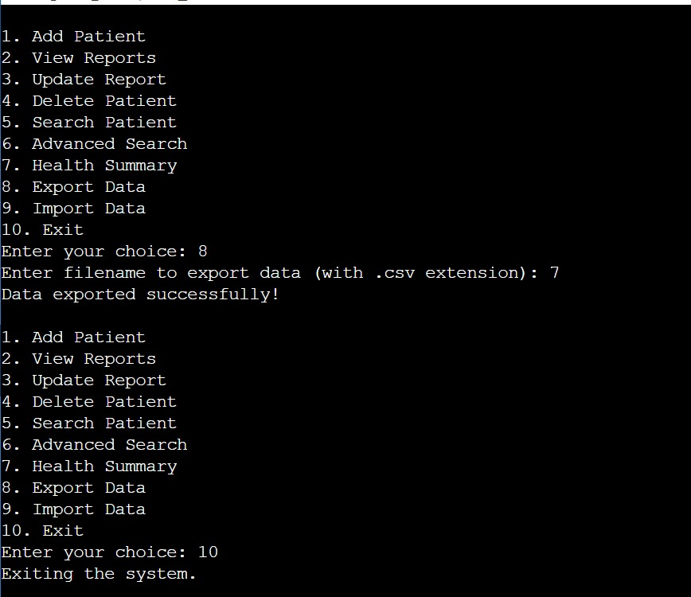

# Automatic Health Monitoring System

## Overview
A console-based Python application designed to manage patient health records, particularly for rural and sub-urban communities. The system helps avoid repetitive diagnostics by maintaining a detailed, up-to-date database of patient information.

## Key Features

- **Add Patient Records:**
  - Capture and store patient details including ID, name, age, gender, diagnosis, and last checkup date.

- **View Reports:**
  - Display all stored patient records with comprehensive details.

- **Update Patient Reports:**
  - Modify existing records with new diagnoses and update the last checkup date.

- **Delete Patient Records:**
  - Remove patient records by entering their ID.

- **Search Patient Records:**
  - Search for specific patients by name or ID.

- **Advanced Search:**
  - Search by:
    - Age range
    - Gender
    - Diagnosis

- **Health Summary:**
  - Generate a summary with:
    - Total number of patients
    - Gender distribution
    - Average age
    - Most common diagnosis

- **Export Data:**
  - Export patient data to a CSV file.

- **Import Data:**
  - Import patient data from a CSV file.

## Benefits

- **Cost-Effective:** Reduces unnecessary diagnostics, saving time and money.
- **Efficient Data Management:** Simplifies patient record keeping with easy data retrieval.
- **Scalable:** Can be extended with more features as needed.

## Technology Stack

- **Programming Language:** Python
- **Data Handling:** CSV files and in-memory dictionary

## Screenshots

### 1. add patients & view reports

### 2. Update & Search Record

### 3. Advanced search Reports

### 4. Health Summary 

### 5. Exporting Data 

